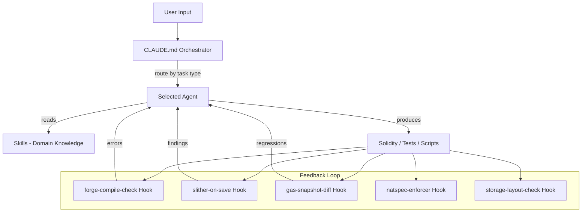

# Architecture

## 1. Overview

EVM Cortex extends Claude Code (and Codex CLI / Cursor) with four component types specialized for Ethereum protocol development: **agents** execute specialized tasks (Solidity engineering, security auditing, DeFi analysis), **skills** provide deep domain knowledge (Uniswap math, gas optimization, audit methodology), **rules** enforce Solidity-specific coding standards, and **hooks** automate real-time feedback (compilation checks, Slither analysis, gas snapshots). The orchestrator (`CLAUDE.md`) routes tasks to the most specific agent available.

## 2. Component Interaction



The flow works like this:

1. User submits a prompt. The `CLAUDE.md` orchestrator classifies the task and routes to the appropriate specialist agent.
2. The agent reads relevant skills for domain knowledge (e.g., `uniswap-v4-expert`, `reentrancy-patterns`, `foundry-testing`).
3. The agent produces Solidity code, tests, or deployment scripts.
4. Hooks fire automatically on `.sol` file edits: compilation check, Slither analysis, gas snapshot diff, NatSpec enforcement, storage layout validation.
5. Errors and warnings feed back into the agent's context for immediate correction.

## 3. Agent System

### Format

50 Markdown files in `agents/`, each with YAML frontmatter:

```yaml
---
name: solidity-engineer
description: Solidity implementation, best practices, NatSpec
model: sonnet
tools: [Read, Bash, Grep, Glob, Write]
---

# Solidity Engineer

You are a specialist in production Solidity implementation...
```

**Frontmatter fields:**

| Field | Required | Values |
|-------|----------|--------|
| `name` | Yes | Agent identifier (kebab-case) |
| `description` | Yes | One-line purpose |
| `model` | No | `sonnet` (default) or `opus` (complex reasoning) |
| `tools` | No | Subset of `[Read, Write, Edit, Bash, Grep, Glob, Task]` |

### Agent Squads

| Squad | Agents | Focus |
|-------|--------|-------|
| Core Protocol Development | 6 | Architecture, implementation, gas, deployment, storage, mechanism design |
| Security Squad | 10 | Audit orchestration, state tracing, token flow, edge cases, external calls, access control, oracle safety, MEV |
| Testing Squad | 5 | Foundry testing, invariant testing, formal verification, fuzzing, PoC writing |
| DeFi Specialists | 7 | Protocol design, AMM, lending, oracles, bridges, tokenomics, yield |
| Uniswap Specialists | 5 | V4 expert, V3 expert, math, LP analysis, pool discovery |
| Tooling & Infrastructure | 6 | Foundry, OpenZeppelin, Slither, subgraphs, dApp frontend, CI/CD |
| Standards & Governance | 5 | EIP/ERC, token implementations, proxy upgrades, governance, L2 |
| Cross-Cutting | 6 | Planning, code review, exploration, bug investigation, documentation, verification |

### Agent Routing

The `CLAUDE.md` orchestrator routes tasks to the most specific agent:

| Task | Agent | Model |
|------|-------|-------|
| Protocol architecture | solidity-architect | opus |
| V4 integration | uniswap-v4-expert | opus |
| LP position analysis | lp-analyst | sonnet |
| Full audit | audit-orchestrator | opus |
| Gas optimization | gas-optimizer | sonnet |
| Foundry tests | foundry-tester | sonnet |

### Audit Pipeline

Multi-phase audit orchestrated by `audit-orchestrator`:

1. **Recon** — Scope, dependencies, automated tools (Slither, Aderyn)
2. **Breadth** — Contract-by-contract surface review
3. **Depth** — Specialized agents analyze in parallel (state-trace, token-flow, edge-case, external)
4. **Chain** — Cross-contract interaction tracing
5. **Verification** — PoC construction for Medium+ findings
6. **Report** — Structured findings with severity classification

## 4. Skill System

### Format

86 `SKILL.md` files across `skills/` subdirectories:

```yaml
---
name: uniswap-v4-expert
description: Use when building on, integrating with, or analyzing Uniswap V4...
---

# Uniswap V4 Expert Knowledge

Architecture, types, code examples, deployment addresses...
```

### Skill Categories

| Category | Examples | Count |
|----------|----------|-------|
| Solidity patterns | solidity-patterns, gas-optimization, storage-layout, error-handling | ~10 |
| Security | reentrancy-patterns, flash-loan-attacks, oracle-manipulation, signature-vulnerabilities | ~12 |
| Uniswap | uniswap-v4-expert, uniswap-v3-expert, uniswap-math, lp-analyst, pool-finder, uniswap-v4-hooks, uniswap-v4-testing | 7 |
| DeFi integration | aave-integration, chainlink-oracles, yield-vault-patterns | ~8 |
| Testing | foundry-testing, invariant-testing, fork-testing, fuzzing-patterns | ~8 |
| Auditing | audit-prep, audit-recon, audit-breadth-scan, audit-depth-analysis | ~8 |
| Token standards | erc20-patterns, erc721-patterns, erc4626-patterns, proxy-patterns | ~8 |
| Tooling | foundry-setup, slither-analysis, cast-commands, forge-scripting | ~8 |
| Deployment | l2-deployment, multichain-deployment, contract-verification | ~6 |

### How Skills Are Used

1. **Agent-referenced**: Agent prompts describe which skills to load. The agent reads the skill file when it needs domain knowledge.
2. **CLAUDE.md routing**: The skill reference table in `CLAUDE.md` maps domains to specific skills.
3. **Direct reference**: Users or agents reference a skill by path: `skills/uniswap-v4-hooks/SKILL.md`.

## 5. Hook System

### Location and Build

- Source: `hooks/src/*.ts`
- Built with esbuild: `npm run build` produces `hooks/dist/*.mjs`
- Tests: `hooks/src/__tests__/` using vitest

### EVM-Specific Hooks

| Hook | Trigger | Purpose |
|------|---------|---------|
| `forge-compile-check` | `.sol` file edit | Runs `forge build`, reports compilation errors |
| `slither-on-save` | `.sol` file edit | Runs Slither, reports High/Medium findings |
| `gas-snapshot-diff` | `.sol` file edit | Compares `forge snapshot`, warns on gas regressions |
| `natspec-enforcer` | `.sol` file edit | Checks for missing NatSpec on public/external functions |
| `storage-layout-check` | `.sol` file edit | Validates storage layout compatibility for upgradeable contracts |

### How Hooks Work

Hooks are standalone TypeScript files compiled to self-contained `.mjs` bundles. They read JSON from stdin and write JSON to stdout:

```typescript
// Inject feedback into the agent's context
{ "additionalContext": "forge build failed: Error on line 42..." }

// Block a dangerous operation
{ "permissionDecision": "deny", "reason": "Credential detected in command" }
```

## 6. Rule System

### Cursor Rules (`.cursor/rules/*.mdc`)

6 Cursor-specific rule files providing IDE-level guidance:

| Rule | Focus |
|------|-------|
| `general.mdc` | Solidity coding standards, security, gas, Foundry |
| `security.mdc` | Vulnerability patterns, attack vectors, SafeERC20 |
| `testing.mdc` | TDD workflow, Foundry testing patterns |
| `agent-development.mdc` | Agent file format and conventions |
| `skill-development.mdc` | Skill file format and conventions |
| `hook-development.mdc` | Hook file format and build process |

### Project Rules (`rules/*.md`)

15 EVM-specific rule files:

| Rule | Focus |
|------|-------|
| `solidity-style-guide.md` | Naming, layout, NatSpec conventions |
| `security-first.md` | Checks-effects-interactions, SafeERC20, reentrancy guards |
| `foundry-workflow.md` | TDD, test naming, forge commands |
| `gas-consciousness.md` | Optimization patterns, forge snapshot |
| `audit-mindset.md` | Writing auditor-friendly code |
| `severity-matrix.md` | Impact × Likelihood classification |
| `finding-output-format.md` | Vulnerability report structure |
| `decimal-awareness.md` | Token decimal handling (USDC=6, WBTC=8) |
| `evm-current-state.md` | 2026 EVM facts (gas, EIPs, toolchain) |
| `onchain-conventions.md` | Terminology, address formatting |
| `contract-addresses.md` | Verification before use, known addresses |
| `upgrade-safety-rules.md` | Storage layout, initializer safety |
| `test-before-deploy.md` | Pre-deployment checklist |
| `report-template.md` | Audit report structure |
| `poc-execution.md` | PoC test requirements and template |

## 7. Directory Structure

```
evm-cortex/
├── agents/                     # 50 agent definitions (.md with YAML frontmatter)
│   ├── solidity-architect.md
│   ├── solidity-engineer.md
│   ├── uniswap-v4-expert.md
│   ├── audit-orchestrator.md
│   └── ...
│
├── skills/                     # 86 skill directories
│   ├── uniswap-v4-expert/SKILL.md
│   ├── uniswap-v3-expert/SKILL.md
│   ├── uniswap-math/SKILL.md
│   ├── foundry-testing/SKILL.md
│   ├── reentrancy-patterns/SKILL.md
│   └── ...
│
├── hooks/
│   ├── src/                    # TypeScript hook source files
│   │   ├── forge-compile-check.ts
│   │   ├── slither-on-save.ts
│   │   ├── gas-snapshot-diff.ts
│   │   ├── natspec-enforcer.ts
│   │   ├── storage-layout-check.ts
│   │   └── shared/             # Shared utility modules
│   ├── dist/                   # Built .mjs bundles (esbuild output)
│   ├── package.json
│   └── tsconfig.json
│
├── rules/                      # 15 EVM-specific rule files
│   ├── solidity-style-guide.md
│   ├── security-first.md
│   ├── severity-matrix.md
│   └── ...
│
├── .cursor/rules/              # 6 Cursor IDE rule files (.mdc)
│
├── CLAUDE.md                   # Orchestrator — agent routing, audit pipeline, rules
├── AGENTS.md                   # Codex CLI instructions
├── README.md                   # Project overview and setup
├── install.sh                  # Claude Code installer
├── install-codex.sh            # Codex CLI installer
├── install-cursor.sh           # Cursor IDE installer
├── package.json                # npm package metadata
├── plugin.json                 # Claude Code plugin metadata
└── LICENSE                     # MIT
```

## 8. For Contributors

### Adding an Agent

Create `agents/my-agent.md`:

```yaml
---
name: my-agent
description: What this agent does in one line
model: sonnet
tools: [Read, Grep, Glob, Bash]
---

# My Agent

System prompt goes here. Define the agent's Ethereum-specific role,
expertise areas, methodology, and output format.
```

### Adding a Skill

Create `skills/my-skill/SKILL.md`:

```yaml
---
name: my-skill
description: When to use this skill and what domain knowledge it provides
---

# My Skill

Domain knowledge — Solidity patterns, protocol mechanics, math,
security patterns, deployment procedures, etc.
```

### Adding a Hook

1. Create `hooks/src/my-hook.ts`
2. Build: `cd hooks && npm run build`
3. Register in Claude Code settings under the appropriate hook type
4. Test: `cd hooks && npm test`

### Project Conventions

- Agents are pure Markdown with YAML frontmatter. No executable code.
- Skills are pure Markdown. Domain knowledge only.
- Rules are pure Markdown. Loaded into every session's context.
- Hooks are TypeScript compiled to ESM bundles. Read stdin JSON, write stdout JSON.
- All Solidity examples must be production-accurate against real contracts.
- Contract addresses must be verified — never hallucinated.
- Say "onchain" not "on-chain."
