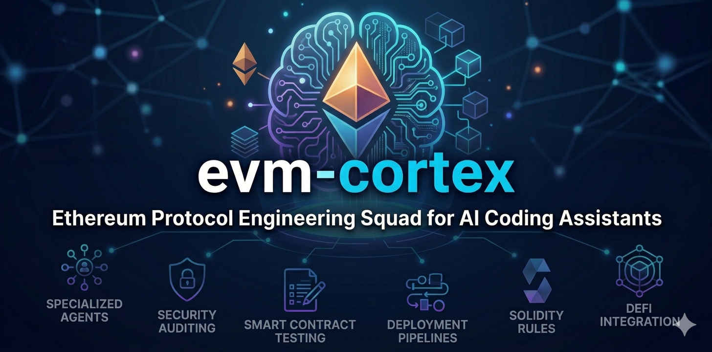

# EVM Cortex



Ethereum protocol engineering squad for AI coding assistants.

50 agents, 91 skills, 19 hooks, and 15 rules covering Solidity development, security auditing, DeFi integration, smart contract testing, and deployment — everything needed to build, audit, and ship smart contracts.

## Install

### Claude Code

```bash
git clone https://github.com/ccashwell/evm-cortex.git
cd evm-cortex
./install.sh
```

### Codex CLI

```bash
git clone https://github.com/ccashwell/evm-cortex.git
cd evm-cortex
./install-codex.sh
```

### Cursor

```bash
git clone https://github.com/ccashwell/evm-cortex.git
cd evm-cortex
./install-cursor.sh
```

### OpenClaw

```bash
git clone https://github.com/ccashwell/evm-cortex.git
cd evm-cortex
./install-openclaw.sh
```

Or zero-copy (add to `~/.openclaw/openclaw.json`):

```json5
{ "skills": { "load": { "extraDirs": ["/path/to/evm-cortex/skills"] } } }
```

## Prerequisites

| Tool | Install | Required |
|------|---------|----------|
| Foundry | `curl -L https://foundry.paradigm.xyz \| bash && foundryup` | Yes |
| Slither | `pip install slither-analyzer` | Recommended |
| Aderyn | `cargo install aderyn` | Optional |
| Node.js 18+ | [nodejs.org](https://nodejs.org) | For hooks |

## What's Inside

### 50 Agents

| Squad | Agents |
|-------|--------|
| Core Protocol (6) | `solidity-architect` `solidity-engineer` `gas-optimizer` `contract-deployer` `storage-layout-analyst` `protocol-designer` |
| Security (10) | `audit-orchestrator` `access-control-reviewer` `depth-state-trace` `depth-token-flow` `depth-edge-case` `depth-external` `mev-analyst` `poc-writer` `security-verifier` `sleuth` |
| Testing (5) | `foundry-tester` `invariant-analyst` `invariant-tester` `formal-verifier` `fuzzer` |
| DeFi (8) | `amm-expert` `lending-expert` `oracle-analyst` `oracle-expert` `bridge-expert` `tokenomics-analyst` `yield-strategist` `defi-architect` |
| Uniswap (5) | `uniswap-v3-expert` `uniswap-v4-expert` `uniswap-math-expert` `lp-analyst` `pool-finder` |
| Tooling (6) | `foundry-expert` `openzeppelin-expert` `slither-analyst` `subgraph-builder` `dapp-frontend` `devops-chain` |
| Standards (5) | `eip-expert` `erc-implementer` `upgrade-planner` `governance-designer` `l2-specialist` |
| Cross-Cutting (5) | `planner` `code-reviewer` `scout` `scribe` `verifier` |

### 91 Skills

| Category | Skills |
|----------|--------|
| Solidity Dev (13) | `solidity-patterns` `type-driven-design` `gas-optimization` `storage-layout` `assembly-patterns` `error-handling` `event-design` `interface-design` `natspec-standards` `library-patterns` `immutable-constants` `constructor-patterns` `solidity-security` |
| Security (15) | `reentrancy-patterns` `flash-loan-attacks` `oracle-manipulation` `access-control-patterns` `signature-vulnerabilities` `front-running-patterns` `integer-overflow` `delegate-call-risks` `denial-of-service` `cross-chain-security` `upgrade-safety` `token-integration-safety` `economic-attack-vectors` `governance-attacks` `time-manipulation` |
| DeFi (12) | `uniswap-v4-hooks` `aave-integration` `compound-patterns` `curve-integration` `chainlink-oracles` `flash-loan-usage` `yield-vault-patterns` `staking-reward-patterns` `governance-patterns` `liquidity-mining` `token-bonding-curves` `dutch-auction-patterns` |
| Uniswap (6) | `uniswap-v4-testing` `uniswap-v4-expert` `uniswap-v3-expert` `uniswap-math` `lp-analyst` `pool-finder` |
| Testing (8) | `foundry-testing` `invariant-testing` `formal-verification` `fork-testing` `gas-snapshot-testing` `coverage-analysis` `fuzzing-patterns` `test-fixtures` |
| Audit (8) | `audit-prep` `audit-recon` `audit-breadth-scan` `audit-depth-analysis` `audit-verification` `audit-report-generation` `pashov-audit-pipeline` `xray-pre-audit` |
| Standards (12) | `erc20-patterns` `erc721-patterns` `erc1155-patterns` `erc4626-patterns` `erc7702-patterns` `erc8004-patterns` `eip712-signing` `create2-patterns` `proxy-patterns` `minimal-proxy` `diamond-pattern` `beacon-proxy` |
| Stablecoins (2) | `usdc-integration` `cctp-bridging` |
| Tooling (8) | `foundry-setup` `slither-analysis` `aderyn-analysis` `cast-commands` `anvil-patterns` `forge-scripting` `contract-verification` `blockscout-mcp` |
| Infrastructure (7) | `subgraph-patterns` `dapp-frontend-patterns` `wallet-integration` `l2-deployment` `multichain-deployment` `ipfs-deployment` `scaffold-eth-patterns` |

### 19 Hooks

| Hook | Trigger |
|------|---------|
| `agent-memory-loader` | Session start |
| `agent-memory-saver` | Session end |
| `bash-audit-log` | Shell command |
| `credential-deny` | Shell command |
| `forge-compile-check` | File save |
| `gas-snapshot-diff` | File save |
| `memory-awareness` | Session start |
| `natspec-enforcer` | File save |
| `passive-learner` | Session end |
| `pre-compact-continuity` | Context compact |
| `sast-on-edit` | File save |
| `session-analytics` | Session end |
| `session-end-cleanup` | Session end |
| `session-outcome` | Session end |
| `session-register` | Session start |
| `session-start-continuity` | Session start |
| `slither-on-save` | File save |
| `storage-layout-check` | File save |
| `transcript-parser` | Session end |

### 15 Rules

`solidity-style-guide` `security-first` `foundry-workflow` `gas-consciousness` `audit-mindset` `severity-matrix` `finding-output-format` `decimal-awareness` `evm-current-state` `onchain-conventions` `contract-addresses` `upgrade-safety-rules` `test-before-deploy` `report-template` `poc-execution`

### Recommended MCP Servers

| Server | Purpose |
|--------|---------|
| [OpenZeppelin MCP](https://mcp.openzeppelin.com/) | Contract generation |
| Blockscout MCP | Onchain data queries |
| Slither MCP | Static analysis |

## Key Principles

**Security first.** Checks-effects-interactions. ReentrancyGuard. SafeERC20. Never trust external calls.

**Foundry workflow.** TDD with forge test. Gas snapshots for regression. Slither before merge.

**Audit mindset.** Write code as if it will be audited tomorrow. Document invariants. Test edge cases.

**Current knowledge.** Gas is under 1 gwei (2026). Foundry is the default toolchain. EIP-7702 is live. Say "onchain" not "on-chain".

## Acknowledgments

Built on knowledge from:

- [ethskills.com](https://ethskills.com/SKILL.md) — Ethereum knowledge corrections for AI agents
- [Plamen](https://github.com/PlamenTSV/plamen) — Autonomous audit pipeline architecture
- [OpenZeppelin Skills](https://github.com/OpenZeppelin/openzeppelin-skills) — Secure contract development
- [evmresearch.io](https://evmresearch.io) — EVM security research
- [Circle Skills](https://github.com/circlefin/skills) — USDC and CCTP integration patterns
- [Pashov Skills](https://github.com/pashov/skills) — Security audit methodology

## License

MIT
